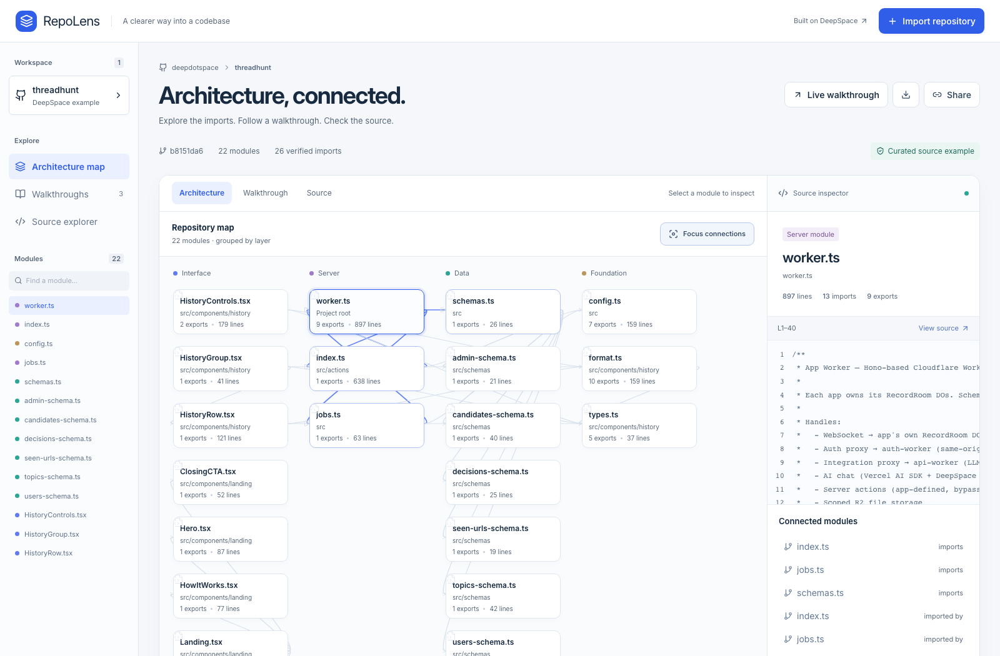

# RepoLens

Understand a public JavaScript or TypeScript repository through an interactive architecture map, source-linked walkthroughs, and contextual questions.

**[Open the app](https://repolens.app.space)** · **[Explore a published analysis](https://repolens.app.space/home?analysis=22c2e718-006e-4206-9d73-0230d7a7152a)**



Built with DeepSpace 0.34.0, React 19, Hono, and a Babel TypeScript parser. The opening example analyzes MIT-licensed source from `deepdotspace/threadhunt` at a pinned commit; attribution is in `public/example-LICENSE.txt`.

## Product flow

1. Explore the bundled example without signing in.
2. Sign in and import a public GitHub repository.
3. A durable DeepSpace job resolves a commit, reads bounded source, parses static imports, and saves the analysis. Progress updates arrive through synchronized records.
4. Select graph modules to inspect code. Walkthrough steps link to exact GitHub lines at that commit.
5. Generate an AI walkthrough or ask about a selected module. AI walkthrough citations are validated against stored file names and line ranges. This validates the reference, not the truth of the interpretation.
6. Invite a registered reviewer to edit tour introductions. Publish a separate snapshot; later draft changes remain private. Unpublish removes the public snapshot.
7. Generate optional ElevenLabs narration or export the analysis as JSON.

## Run

Use Node 22.15+, 24, or 26 and npm 11.6+.

```sh
npm ci
npx deepspace auth login
npx deepspace dev start --port 5180
```

```sh
npm run type-check
npx vitest run src/repolens/analyzer.test.ts
npx deepspace test run all --port 5182
npx deepspace deploy
```

Multi-user tests require two local DeepSpace test accounts. Create them using `npx deepspace test accounts create --help`; credentials are stored by the CLI, not in this repository. The collaboration test makes a real bounded public GitHub import and consumes a small amount of integration credit. AI and narration are verified separately so the regular suite does not generate paid media.

## DeepSpace responsibilities

- Authentication and verified caller identity.
- `RecordRoom` schemas, access control, persistence, and live updates.
- `JobRoom` durable repository analysis, progress, and failure state.
- Integration proxy: GitHub metadata/tree/commit, Anthropic explanation, ElevenLabs speech.
- Worker deployment and application identity.

Raw source is downloaded from GitHub at the resolved commit. Repository code is parsed as data and never executed. No GitHub token is requested from the user.

## Implementation map

- `src/repolens/analyzer.ts`: repository validation, AST imports, module classification, source-derived tours, citation validation.
- `src/repolens/server.ts`: bounded repository ingestion and integration calls.
- `src/actions/index.ts`: authenticated operations; explicit ownership checks because action tools bypass record RBAC.
- `src/jobs.ts`: durable import lifecycle and progress persistence.
- `src/repolens/schema.ts`: private analyses and public snapshots.
- `src/repolens/Workspace.tsx`: map, source inspector, tour player, import/share/edit flows.
- `worker.ts`: standard DeepSpace wiring and a durable usage counter.

## Boundaries and tradeoffs

This is a static dependency explorer, not a runtime tracer or an arbitrary-program architecture oracle. The map proves syntactic imports, not calls at runtime. Layer placement is a filename heuristic. Dynamic imports, custom aliases, monorepo package resolution, and non-JavaScript languages are outside this version.

Imports are capped at 32 source files, 22 KB per file, and 180 KB total. Partial analysis is labeled. AI receives a bounded excerpt; it may be unable to explain omitted code. Narration is capped at 2,000 characters and returned for playback in the current session; it is not a persistent hosted audio artifact.

The app limits each user to 5 imports, 4 AI walkthroughs, 12 questions, and 2 narrations per UTC day, with an 80-operation daily application ceiling. Failed calls consume an attempt. The generic browser integration proxy is closed so it cannot bypass these limits. Native job socket access is owner/admin-only; members request the named import job through a validated action.

Reviewers must sign in once before an owner can invite them by email. Reviewers edit the tour introduction; simultaneous edits use last-write-wins record updates. Public sharing uses independent snapshots because the installed SDK's action broadcast path does not evict previously delivered private records on visibility changes. Deleting a public snapshot emits a proper removal event. Revocation prevents future access; it cannot erase copies a viewer already saved.

DeepSpace is the deployment source authority for this app. The GitHub repository is a reviewable mirror. Releases are built from committed DeepSpace source; update and deploy there first, then push the same commit to GitHub.
